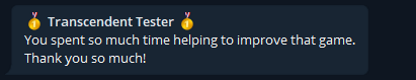
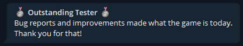

# Telegram Typer
An incremental game using the Telegram platform.

Go play the game [@TTyperBot](https://t.me/TTyper).

## Setup
### Prerequisites:
- Python 3.7+
- Pip 18.1+

### Installation
1. `git clone <repo>`
1. `cd path/to/repo`
1. `python -m venv ./env`
1. `source env/bin/activate`
1. `pip install -r requirements.txt`

### Configuration
1. `cp secret.py.dist secret.py`
2. In the `secret.py` file, add your bot token (from [@BotFather](https://t.me/BotFather)), your bot name (including the `@`), and your admin ID/admin groupchat ID.
   - You can use [@VroumBot](https://t.me/VroumBot) to get IDs with the command `/id` or `/chatid`.

## Usage
Simply `python main.py`, and everything should be working out of the box!

### Admin commands
cf. `handlers.py/AdminHandlers`

- `/debug`, `/cheat` or `/rich` - Add 10M to the user.
- `/cap` - Add the maximum messages to the user.
- `/notify <message>` - Prepare a "Message from admin" to be send to every player in the database. Answer to a message with `/notify` to send that very message.
- `/total`, `/total_players` - How many players are currently playing.
- `/alpha_ended` - Unlock the "A Special Place in my Heart" achievement for all current players.
- `/beta_ended` - Unlock the "It's working now, right?.." achievement for all current players.

## Wall of fame
If I forgot you send me a DM... c:

### Transcendent Tester

* gershik
* cammonte

### Outstanding Tester

* Felix 3
* Melon
* Julien

### Remarkable Tester

* magalí
* Sgit
* const
* T'àwq'an | Tim
